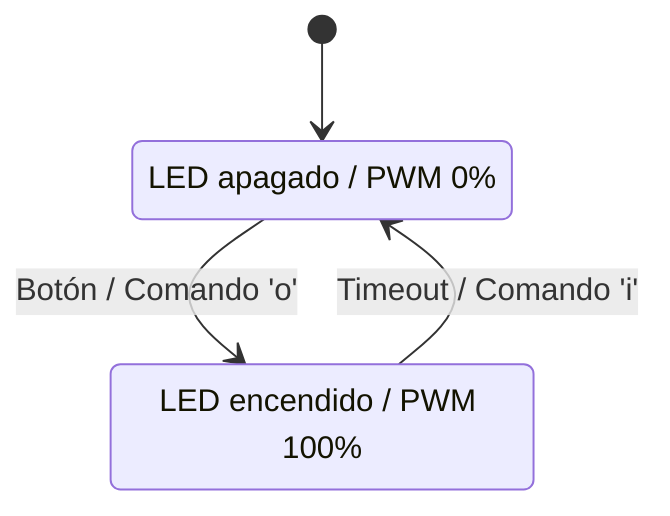
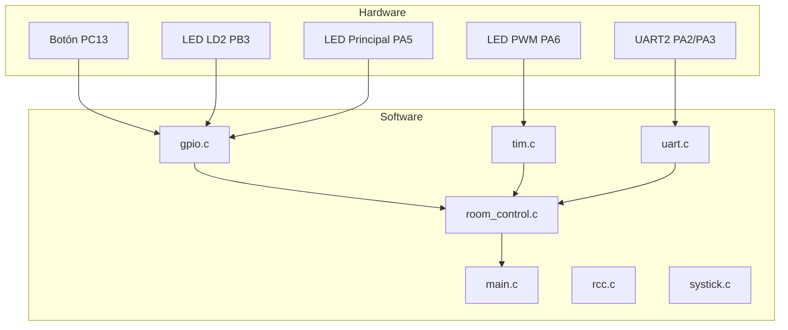

# 11. USER_MANUAL.md

## Manual de Usuario: Sistema de Control de Sala

**Universidad Nacional de Colombia – Sede Manizales**  
**Curso:** Estructuras Computacionales (4100901)  
**Proyecto:** *Room Control – Bare Metal*  

---

### 1. Introducción

El **Sistema de Control de Sala** es un proyecto que simula el control básico de una habitación mediante una placa **STM32L476RG**.  
A través de un LED, un botón y comunicación UART, se puede encender o apagar una “bombilla” y controlar su brillo usando **PWM **.  

Este proyecto busca integrar los diferentes módulos vistos durante el curso: configuración en ensamblador, uso de periféricos en C, temporización, interrupciones y comunicación serial.  

El objetivo final es tener un sistema que responda a eventos tanto físicos (el botón) como por software (comandos UART), imitando el comportamiento de un pequeño controlador de sala o domótica.  

---

### 2. Hardware Utilizado

- **Placa:** STM32 NUCLEO-L476RG.  
- **LED LD2:** LED verde integrado (indicador del sistema).  
- **LED externo:** Conectado al pin **PA5**, simula la “bombilla principal”.  
- **LED PWM:** Conectado al pin **PA6**, simula una bombilla regulable.  
- **Botón de usuario (B1):** En **PC13**, usado para encender la luz principal.  
- **Comunicación UART:** Usando **PA2 (TX)** y **PA3 (RX)** conectados al puerto USB virtual (COM).  

---

### 3. Funcionalidades

#### 3.1 Heartbeat LED
El LED LD2 (en el pin PB3) parpadea continuamente para indicar que el sistema está encendido y funcionando correctamente.  
Sirve como un “pulso” del sistema, mostrando que el microcontrolador no se ha detenido.  

#### 3.2 Control de Bombilla por Botón
El botón del usuario (PC13) enciende la bombilla principal (LED de PA5).  
- Al presionar el botón, el LED se enciende y permanece así durante **3 segundos**.  
- Luego de ese tiempo, el sistema apaga automáticamente el LED.  
- Durante este evento, se envían mensajes por UART informando la acción (por ejemplo: *“Luz encendida”*, *“Luz apagada”**“brillo ajustado”*).  

#### 3.3 Comunicación UART
El sistema se puede controlar también por comandos desde un monitor serial  a **115200 bps**.  
Los principales comandos son:  
- `o` → Cambia el sistema a modo *ocupado* (enciende la luz).  
- `i` → Cambia a modo *idle* o *en reposo* (apaga la luz).  
- `h` → Fija el brillo PWM al **100 %**.  
- `l` → Fija el brillo PWM al **0 %** (apagado).  
- `1`–`9` → Cambia el brillo de la bombilla PWM del **10 % al 90 %**.  

El sistema también responde con mensajes como *“Sala ocupada”*, *“Sala vacía”* o *“Brillo ajustado al %”*.  

#### 3.4 Control PWM de Bombilla
El LED en **PA6** está controlado por el temporizador **TIM3_CH1**, configurado en modo PWM con frecuencia de **1 kHz**.  
Este LED representa una luz con brillo ajustable, permitiendo variar la intensidad según los comandos UART.  

---

### 4. Arquitectura del Sistema

#### 4.1 Módulos
El proyecto se divide en varios módulos que trabajan juntos:  

| Módulo | Descripción |
|--------|--------------|
| `gpio.c / gpio.h` | Configura los pines de entrada y salida. |
| `rcc.c / rcc.h` | Maneja los relojes del sistema. |
| `systick.c / systick.h` | Controla los retardos y el tiempo del sistema. |
| `uart.c / uart.h` | Gestiona la comunicación serial (UART2). |
| `tim.c / tim.h` | Configura el PWM para el control de brillo. |
| `room_control.c / room_control.h` | Implementa la lógica principal del sistema (botón, UART y PWM). |
| `main.c` | Integra todos los módulos e inicia la aplicación. |

#### 4.2 Flujo de Ejecución

1. **Inicialización:**  
   Se configuran los periféricos (GPIO, SysTick, UART, TIM3 y NVIC).  
2. **Bucle principal:**  
   El sistema espera eventos.  
   - Si hay una pulsación de botón, se procesa el evento y se actualiza el estado de la sala.  
   - Si llega un carácter por UART, se interpreta como un comando y se ejecuta la acción correspondiente.  
3. **Interrupciones:**  
   - **SysTick** actualiza el contador de milisegundos.  
   - **EXTI15_10_IRQHandler** detecta la pulsación del botón.  
   - **USART2_IRQHandler** recibe los caracteres por UART.  
4. **Actualización periódica:**  
   `room_control_update()` revisa si el LED debe apagarse después del tiempo establecido.  

---

### 5. Uso del Sistema

#### 1. Conexión
1. Conecta la placa **NUCLEO-L476RG** por USB al computador.  
2. Abre un monitor serial.  
3. Configura la conexión con:  
   - **Baud rate:** 115200  
   - **Bits de datos:** 8  
   - **Paridad:** Ninguna  
   - **Bits de parada:** 1    

#### 2. Inicio
Al energizar la placa:  
- El LED *heartbeat* comienza a parpadear.  
- El monitor serial muestra el mensaje:  
  ```
  Sistema de Control de Sala Inicializado!
  ```  

#### 3. Interacción
- **Botón físico:** Presiona B1 para encender la luz por 3 segundos.  
- **Comandos UART:** Envía letras o comandos como `o`, `i`, `h`, `l`, o `1-9` para controlar el sistema.  
- **PWM:** Observa cómo cambia el brillo del LED en PA6 según el comando.  

---

### 6. Diagramas

#### Diagrama de Estados



#### Diagrama de Componentes



---

### 7. Conclusión

El **Sistema de Control de Sala** demuestra cómo integrar varios periféricos en un entorno embebido para construir una aplicación funcional y modular.  
Combina interrupciones, control por PWM, comunicación serial y una lógica de estados sencilla.  
Además, muestra la evolución del código desde ensamblador hasta un proyecto completo en C estructurado con librerías.  

Este sistema puede servir como base para proyectos más grandes, como sistemas de iluminación inteligentes o automatización doméstica básica.  

---

**Fin del Manual**
